# MoGAIT — Motion & Gait AI Intelligence Tool

<div align="center">

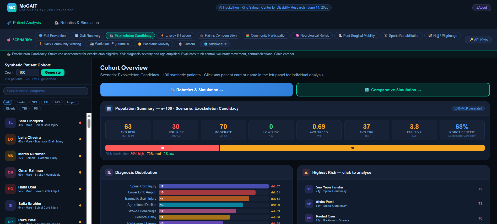

**AI-powered decision support system for rehabilitation robotics and gait analysis**

[](https://utkukose.github.io/mogait/)
[](LICENSE)
[](#)
[](#)

*Developed for the **AI Hackathon for People with Disabilities***  
*King Salman Center for Disability Research · Riyadh · June 14, 2026*

**Prof. Dr. Utku Köse** · IEEE Senior Member · ACM Professional Member  
Süleyman Demirel University · University of North Dakota · VelTech University · Universidad Panamericana

</div>

---

## Table of Contents

- [Overview](#overview)
- [Live Demo](#live-demo)
- [Key Features](#key-features)
- [AI Architecture](#ai-architecture)
  - [Patient Generator (GEN\_NET)](#patient-generator-gen_net)
  - [Risk Classifier (RISK\_NET)](#risk-classifier-risk_net)
  - [Scenario-Adaptive XAI Engine](#scenario-adaptive-xai-engine)
  - [Counterfactual XAI](#counterfactual-xai)
  - [Multi-LLM Clinical Advisor](#multi-llm-clinical-advisor)
- [Scenario System](#scenario-system)
- [Patient Analysis Module](#patient-analysis-module)
- [Robotics & Simulation Module](#robotics--simulation-module)
  - [Device Match](#device-match)
  - [Control Dynamics](#control-dynamics)
  - [Gait-Robot Interaction](#gait-robot-interaction)
  - [4-Week Session Plan](#4-week-session-plan)
  - [Cohort & Patient Simulation](#cohort--patient-simulation)
- [Clinical Evidence Base](#clinical-evidence-base)
- [Technical Architecture](#technical-architecture)
- [Repository Structure](#repository-structure)
- [Running Locally](#running-locally)
- [API Keys (Optional)](#api-keys-optional)
- [Clinical Disclaimer](#clinical-disclaimer)
- [References](#references)

---

## Overview

MoGAIT is a single-file, browser-based AI platform that integrates neural network-driven patient synthesis, explainable AI (XAI), rehabilitation robotics decision support, and multi-scenario mobility simulation — all without a server, database, or installation.

It was designed to answer a practical question at the intersection of AI and disability research: *"Given this patient's profile, in this specific real-world context, which rehabilitation robot should be used, how should it be controlled, and what outcome can be expected?"*

The system addresses clinical, community, and mass-gathering mobility scenarios — including Hajj pilgrimage, post-stroke gait rehabilitation, paediatric mobility, and 13 other real-world contexts.

---

## Live Demo

> **[▶ Open MoGAIT in your browser](https://utkukose.github.io/mogait/)**

No installation. No sign-up. Works on Chrome, Edge, Firefox (desktop).

**Quick start:**
1. Enter a patient count (e.g. 30) → click **Generate**
2. Select any scenario from the strip (try *Hajj / Pilgrimage* or *Gait Recovery*)
3. Click any patient card on the left to open their full analysis
4. Switch to **Robotics & Simulation** tab for device matching, simulation, and planning

---

## Key Features

| Module | What it does |
|--------|-------------|
| **Synthetic Cohort Generation** | VAE+MLP generates realistic patient cohorts (10–200 patients) across 8 diagnosis groups |
| **Multi-Domain Risk Profiling** | 6-dimension risk profile: Fall Risk, Fatigue, Pain Impact, Mobility Score, Participation Index, Rehab Potential |
| **Scenario-Adaptive XAI** | Feature importance re-weighted per scenario — same patient, different scenario = different XAI priorities |
| **Counterfactual XAI** | Interactive sliders simulate clinical interventions: "If we improve gait speed to 0.9 m/s, risk drops by X" |
| **Device Match** | 6 robot types matched to patient by diagnosis, scenario, and clinical indicators |
| **Control Dynamics** | 6 control algorithms visualised as patient-specific torque profiles over the gait cycle |
| **Gait-Robot Interaction** | Pre/post therapy hip flexion comparison with diagnosis-stratified RCT effect sizes |
| **4-Week Session Plan** | Personalised rehabilitation plan with weekly targets, session intensity, and dual-axis progression chart |
| **Cohort Simulation** | 40-agent without-robot vs. with-robot comparative animation across 13 environments |
| **Patient Simulation** | Selected patient starred (★) in both panels; live fall count, speed gain, and fatigue reduction |
| **AI Clinical Advisor** | Claude, Gemini, or GPT-4o generates scenario-aware clinical reasoning (BYOK) |
| **19 Scenarios** | 13 primary + 6 faith & cultural gathering scenarios, each with independent XAI weights |

---

## AI Architecture

### Patient Generator (GEN\_NET)

```
Latent vector z ∈ ℝ¹²  →  [32] → [48] → [32] → [20]  →  Patient parameters
```

A VAE-style decoder generates 20 clinical parameters from a 12-dimensional random latent input. Each of the 8 diagnosis groups (stroke, SCI, CP, MS, amputation, elderly, TBI, Parkinson's) has group-specific priors for gait speed, asymmetry, variability, comorbidity burden, and energy cost. The network uses ReLU activations with sigmoid/tanh output clamping per parameter type.

**Generated parameters include:**
- Gait speed (m/s), step asymmetry (%), gait variability (CV%), cadence (spm)
- TUG test time (sec), stride length (m), double support time (%)
- Fall history (falls/year), pain score (VAS 0–10), energy cost (J/kg/m)
- Medications count, comorbidity list, age, BMI, SpO₂, heart rate
- Post-event week, WMCA classification

### Risk Classifier (RISK\_NET)

```
10 clinical inputs  →  [24] → [24] → [16] → [4]  →  Risk tier (Low / Moderate / High / Critical)
```

A 4-layer MLP classifies each patient into one of four risk tiers using 10 normalised inputs:

| Input | Normalisation | Clinical weight |
|-------|--------------|-----------------|
| Gait Speed | ÷ 1.4 | Fall risk inverse |
| Step Asymmetry | ÷ 70 | Compensation marker |
| TUG Test | ÷ 62 | Mobility threshold |
| Fall History | ÷ 10 | Strongest predictor |
| Pain Score | ÷ 10 | Compensation driver |
| Medications | ÷ 13 | Polypharmacy risk |
| Comorbidities | ÷ 10 | Systemic burden |
| Gait Variability | ÷ 17 | Pre-fall signal |
| Diagnosis Severity | categorical | Neurological grade |
| Age (normalised) | ÷ 90 | Physiological reserve |

A power-transform calibration (`raw^0.72 × 88 + 5`) prevents ceiling saturation and ensures a realistic clinical distribution (~30% low / ~40% moderate / ~30% high risk).

### Scenario-Adaptive XAI Engine

Each feature's contribution to risk is measured via **finite-difference gradient sensitivity**:

```
∂risk/∂xᵢ ≈ [f(x + εeᵢ) − f(x − εeᵢ)] / 2ε,   ε = 0.001
```

These raw gradients are then **re-weighted by the active scenario's SC_MODS vector** — a 10-dimensional weight array that encodes which clinical features matter most in each scenario:

| Scenario | Top amplified features | Clinical rationale |
|----------|----------------------|-------------------|
| Fall Prevention | ▲ Fall History (×1.6), ▲ TUG (×1.4) | Direct fall predictors |
| Exoskeleton Candidacy | ▲ Diagnosis (×1.7), ▲ Age (×1.5) | Device eligibility criteria |
| Sports Rehabilitation | ▲ Asymmetry (×1.7) | Limb Symmetry Index target |
| Hajj / Pilgrimage | ▲ Age (×1.6), ▲ Variability (×1.5), ▲ Comorbidity (×1.5) | Heat + crowd collapse risk |
| Energy & Fatigue | ▲ Variability (×1.4), ▲ Age (×1.5) | Fatigue compounds over time |
| Pain & Compensation | ▲ Pain (×1.8), ▲ Asymmetry (×1.5) | Compensatory gait patterns |

When a scenario is changed, the XAI panel updates instantly — the same patient shows different feature importances, with **▲ amber badges** for amplified features and **▼ grey badges** for depressed ones.

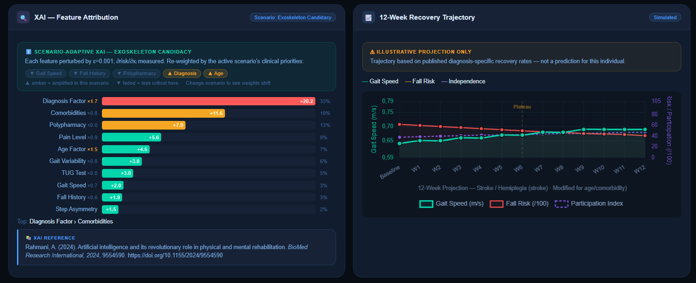

### Counterfactual XAI

> *"If we improve this patient's gait speed from 0.64 m/s to 0.90 m/s via exoskeleton — how much does risk drop?"*

Six interactive sliders allow simulation of clinical interventions. Each slider change re-runs RISK_NET instantly and displays the Δ risk score. Each slider is labelled with the intervention that would achieve it (e.g., *"Exoskeleton, treadmill training, walker"* for gait speed).

This implements **counterfactual reasoning** — XAI showing not just *which* features matter, but *how much* changing them would help.

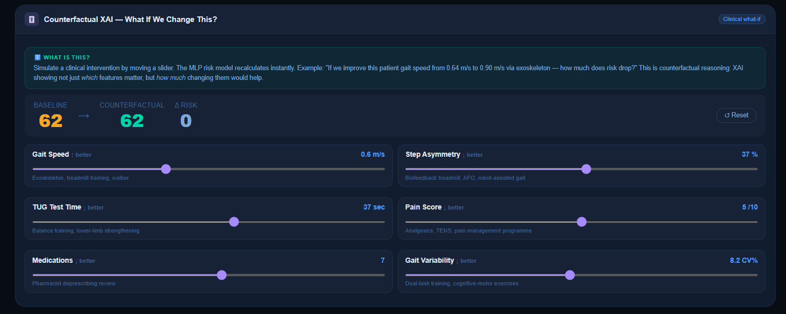

### Multi-LLM Clinical Advisor

Three large language models are available via user-supplied API keys (BYOK — keys used only for the direct API call, never stored):

- **Claude** (Anthropic) — primary clinical reasoning
- **Gemini** (Google)
- **GPT-4o** (OpenAI)

The advisor receives the full patient profile, active scenario, XAI attribution results, and risk scores. It generates scenario-contextualised clinical interpretation including intervention priorities, safety flags, and monitoring plan.

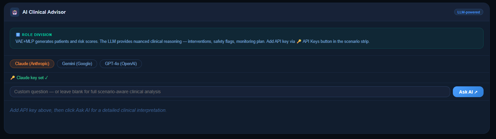

---

## Scenario System

MoGAIT supports **19 scenarios** in two groups:

### Primary Scenarios (always visible)

| Scenario | XAI Focus | Environment |
|----------|-----------|-------------|
| 🛡️ Fall Prevention | Fall history, TUG, polypharmacy | Home obstacle course |
| 🔄 Gait Recovery | Speed, asymmetry | Clinic parallel bars |
| 🦾 Exoskeleton Candidacy | Diagnosis severity, age | Clinic corridor |
| ⚡ Energy & Fatigue | Variability, age | Community walking |
| ⚖️ Pain & Compensation | Pain, asymmetry | Clinic |
| 🏘️ Community Participation | Speed, participation | Urban street |
| 🧠 Neurological Rehab | Asymmetry, fall history | Clinic |
| 🏥 Post-Surgical Mobility | Speed, polypharmacy | Hospital ward |
| 🏋️ Sports Rehabilitation | Asymmetry (LSI) | Rehab gymnasium |
| 🕌 Hajj / Pilgrimage | Age, variability, comorbidity | Tawaf (Kaaba orbit) |
| 🚶 Daily Community Walking | Speed, participation | Community |
| 🏭 Workplace Ergonomics | Pain, asymmetry | Factory/office |
| 👶 Paediatric Mobility | Diagnosis, participation | Clinic |

### Additional: Faith & Cultural Gathering Scenarios

Accessible via the **🌍 Additional** dropdown. All validated for robotic rehabilitation compatibility (flat terrain, controlled environments):

| Scenario | Notes |
|----------|-------|
| 🕍 Wailing Wall Plaza | Cobblestone, elderly pilgrims, hip-assist optimal |
| ✝️ Vatican Pilgrimage | St. Peter Square, prolonged standing |
| 🕋 Umrah (Off-peak) | Marble surface, off-peak Tawaf |
| 🏔️ Lourdes Pilgrimage | Most accessible pilgrimage site globally |
| 🛤️ Camino (Urban Stages) | Flat paved sections, FDA-accessible routes |
| 🌿 Medjugorje Pilgrimage | Gentle terrain, disability pilgrim infrastructure |

> **Note:** Kumbh Mela was explicitly excluded — stampede risk, mud terrain, and no assistive robot infrastructure make it incompatible with exoskeleton use.

---

## Patient Analysis Module

### Cohort Overview


Generate 10–200 synthetic patients. The cohort overview shows:
- Population summary: avg risk, high/moderate/low distribution, avg speed, TUG, falls/yr, robot benefit
- Diagnosis distribution bar chart with per-diagnosis risk scores
- Highest-risk patients for immediate triage
- Search and filter by name or diagnosis group

### Individual Patient View

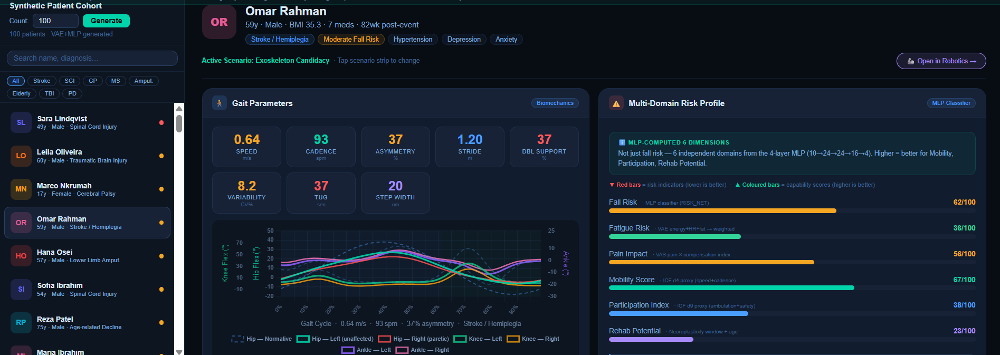

Selecting a patient reveals:

**Gait Parameters** — Chart.js multi-axis chart showing Hip, Knee, and Ankle flexion angles across the gait cycle, with normative Winter (2009) reference curves and patient Left vs. Right (paretic) differentiation. Step asymmetry and variability are embedded directly in the curve shape.

**Multi-Domain Risk Profile** — 6-bar MLP-computed profile:
- **Fall Risk** — RISK_NET output
- **Fatigue Risk** — energy cost × age weighted
- **Pain Impact** — VAS pain × compensation index
- **Mobility Score** — ICF d4 proxy (speed × cadence)
- **Participation Index** — ICF d9 proxy (ambulation safety)
- **Rehab Potential** — neuroplasticity window × age

**Clinical Flags & Comorbidities**

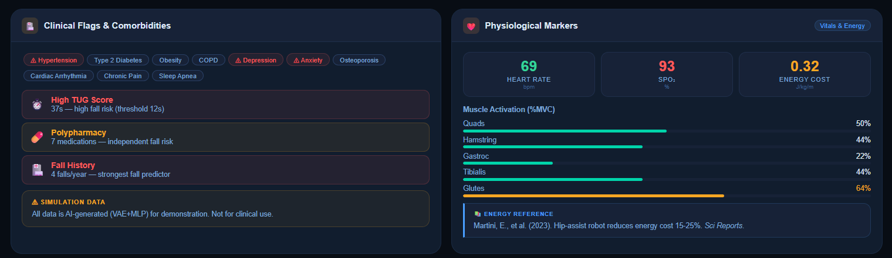

Automated flagging of High TUG Score, Polypharmacy, Fall History, and comorbidities. Physiological markers include heart rate, SpO₂, energy cost (J/kg/m), and muscle activation (%MVC) for five muscle groups.

**Evidence-Based Interventions**

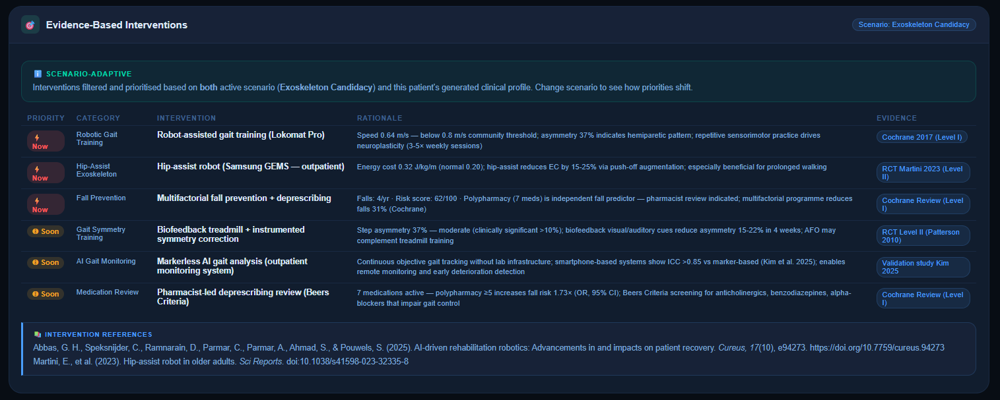

Scenario-adaptive intervention priorities with:
- Priority level (Now / Soon)
- Intervention category and specific recommendation
- Full clinical rationale linked to patient parameters
- Level of evidence (Cochrane Level I / RCT Level II)
- In-line APA references

**XAI Feature Attribution + 12-Week Trajectory**


- Horizontal bar chart of 10 feature importances (absolute gradient magnitude)
- Scenario weight multipliers shown per bar (×1.7, ×0.6 etc.)
- 12-week trajectory: gait speed (left axis), fall risk + participation index (right axis)
- Diagnosis-stratified recovery rates with plateau annotation
- Age and comorbidity modifiers applied to recovery slope

**Counterfactual XAI**


**AI Clinical Advisor**


---

## Robotics & Simulation Module

### Device Match

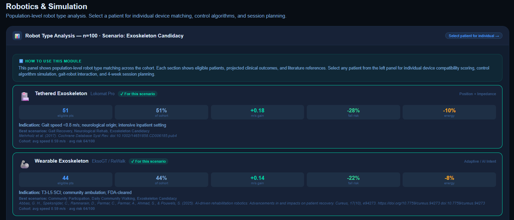
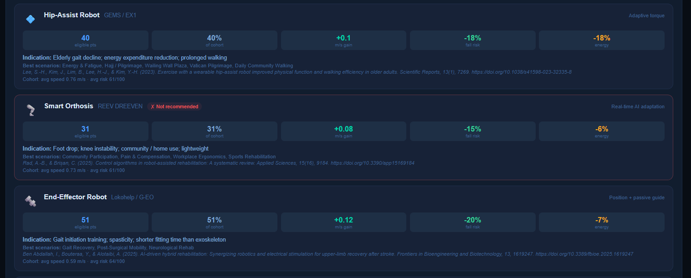

Population-level analysis shows all 6 robot types with:
- Eligible patient count + % of cohort
- Projected speed gain, fall risk reduction, energy saving
- **Scenario compatibility badges**: ✓ For this scenario (teal) / ✗ Not recommended (red)
- Clinical indication, best scenarios, full verified APA reference

Individual patient view (Device Match tab) computes **compatibility scores** (0–100) based on diagnosis, gait speed, age, and clinical setting — sorted by suitability.

**Supported robot types:**
| Robot | Example | Best for |
|-------|---------|---------|
| 🏥 Tethered Exoskeleton | Lokomat Pro | Stroke, SCI, TBI (inpatient) |
| 🦾 Wearable Exoskeleton | EksoGT / ReWalk | SCI, stroke (community) |
| 💠 Hip-Assist Robot | GEMS / EX1 | Elderly, prolonged walking |
| 🦿 Smart Orthosis | REEV DREEVEN | Foot drop, MS, CP |
| 🔩 End-Effector Robot | Lokohelp / G-EO | Gait initiation, spasticity |
| ⚙️ Functional Trainer | AlterG / PDSYS | Sports rehab, body-weight support |

### Control Dynamics

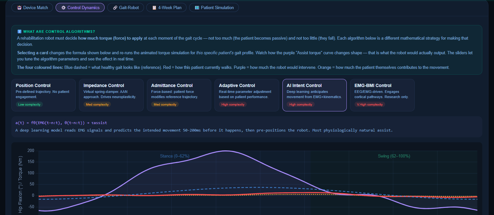

Six control algorithms are selectable via card UI, each producing a **characteristically different torque profile** over the gait cycle:

| Algorithm | Torque characteristic | Complexity |
|-----------|----------------------|------------|
| Position Control | Rigid step shape at stance/swing transition | Low |
| Impedance Control | Smooth sinusoidal + damping term | Medium |
| Admittance Control | Phase-shifted, lags patient force | Medium |
| Adaptive Control | Decaying envelope as patient effort increases | High |
| AI Intent Control | Leads the movement by ~60 ms (predictive) | High |
| EMG-BMI Control | Irregular bursts, cortical-pathway driven | V.High |

Interactive sliders control stiffness (Kd), damping (Bd), max torque, and patient effort — the Chart.js chart re-renders in real time. Patient-specific modulation: the torque curve reflects this patient's actual gait speed, asymmetry, and variability.

### Gait-Robot Interaction

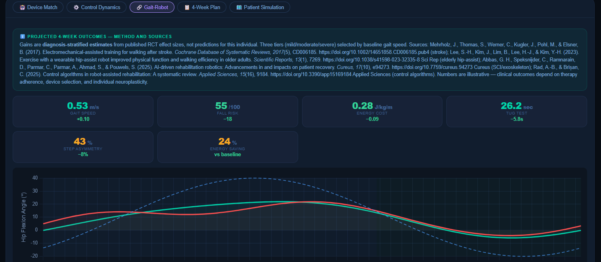

Pre-therapy and post-therapy hip flexion angle compared against the Winter (2009) normative reference, rendered as a Chart.js multi-line chart. Post-therapy curves are computed from **diagnosis-stratified RCT effect sizes** (Mehrholz 2017, Lee et al. 2023).

Six outcome cards show projected 4-week gains: speed, fall risk, energy cost, TUG, step asymmetry, and energy saving — all with delta values vs baseline.

### 4-Week Session Plan

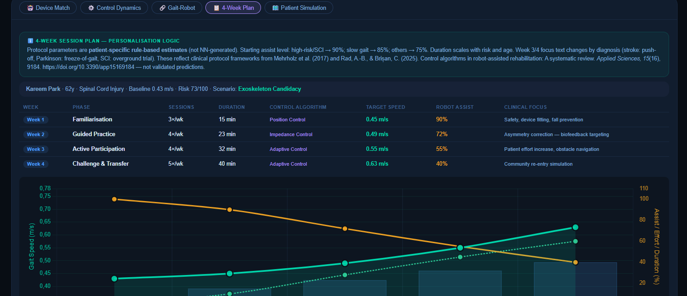

A personalised rehabilitation plan with:
- Week-by-week phase (Familiarisation → Guided Practice → Active Participation → Challenge & Transfer)
- Session frequency, duration, control algorithm, speed target, robot assist %, patient effort %
- Starting assist level personalised to risk tier (high-risk/SCI → 90%; standard → 75%)
- **Chart.js mixed chart**: session duration as bars, gait speed and assist/effort as dual-axis lines

### Cohort & Patient Simulation

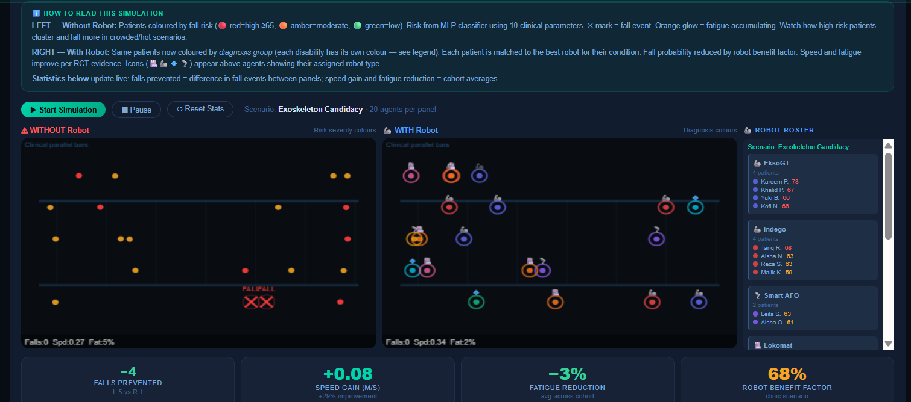
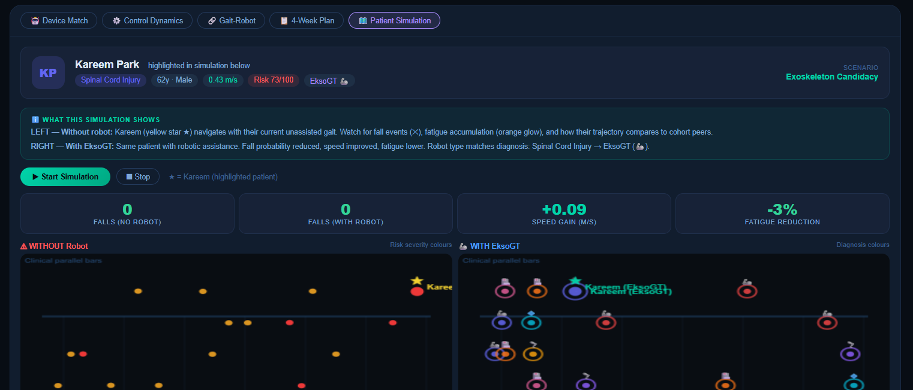

**Cohort Simulation** — 40-agent side-by-side comparison:
- LEFT: WITHOUT robot — agents coloured by fall risk severity (🔴 high ≥65, 🟡 moderate, 🟢 low)
- RIGHT: WITH robot — agents coloured by diagnosis group; robot type icon above each agent
- ROBOT ROSTER — live panel showing which patient uses which device
- Live HUD: falls, avg speed, avg fatigue per panel
- Live stats: falls prevented, speed gain, fatigue reduction, robot benefit factor

**Patient Simulation** — selected patient tracked individually:
- Patient highlighted with ★ star in both canvases
- Live 4-metric panel: Falls (no robot) / Falls (with robot) / Speed gain / Fatigue reduction
- Robot type matched to diagnosis (SCI → EksoGT 🦾, Elderly → GEMS 💠, Stroke → Lokomat 🏥...)

**13 simulation environments** including: clinical parallel bars, rehabilitation gymnasium, Tawaf (counterclockwise Kaaba orbit), cobblestone plaza, community street, hospital ward, workplace floor.

---

## Clinical Evidence Base

MoGAIT's parameters, effect sizes, and recommendations are grounded in peer-reviewed literature:

| Evidence item | Source |
|--------------|--------|
| Electromechanical gait training: OR 1.94 for independent walking | Mehrholz et al. (2017), Cochrane |
| Hip-assist robot reduces energy cost 15–25% in elderly | Lee et al. (2023), *Scientific Reports* |
| AI-assisted rehabilitation superiority in MSK disorders | Luo et al. (2025), *Front. Bioengineering* |
| Gait speed <0.8 m/s: limited community ambulation threshold | Fritz & Lusardi (2009), *JGPT* |
| Gait variability: fall prediction sensitivity 80%+ | Hausdorff et al. (2001), *Arch Phys Med* |
| Step asymmetry >25%: hemiparetic compensation | Patterson et al. (2010), *Arch Phys Med* |
| Intent recognition in rehabilitation robots (systematic review) | Luo et al. (2024), *Disabil Rehabil Assist Technol* |
| Control algorithms review (2020–2024) | Rad & Brișan (2025), *Applied Sciences* |
| AI-driven rehabilitation robotics | Abbas et al. (2025), *Cureus* |
| Hajj 2024: 1,301 heat deaths, pilgrim age 54.98 ± 13.96 yrs | Alzaben et al. (2024), *PLOS ONE* |
| Hajj AI & crowd management | Alam et al. (2024), *IEEE Access* |
| Telestroke at Hajj 2023–2024 | Alfurayh et al. (2025), *Front. Neurology* |

---

## Technical Architecture

| Aspect | Detail |
|--------|--------|
| **Deployment** | Single HTML file (`index.html`) — no server, no build step, no dependencies to install |
| **File size** | ~204 KB |
| **Neural network** | Pure JavaScript — GEN_NET (VAE decoder 12→32→48→32→20) + RISK_NET (MLP 10→24→24→16→4) |
| **Chart engine** | Chart.js 4.4.1 (loaded from cdnjs CDN) |
| **Simulation** | Canvas API — 40-agent animation, 13 environment renderers |
| **XAI** | Finite-difference gradient sensitivity, scenario-reweighted (SC_MODS 10-dim vector per scenario) |
| **LLM integration** | Direct browser → Anthropic / Google / OpenAI API calls (BYOK, keys never stored) |
| **Data** | All patient data is synthetically generated at runtime — no real patient data, no storage |
| **Browser support** | Chrome 90+, Edge 90+, Firefox 88+ (desktop) |

---

## Repository Structure

```
mogait/
├── index.html          # The entire application (single file)
├── README.md           # This file
├── LICENSE             # MIT
└── images/             # Screenshots for README
    ├── 1.png           # Cohort Overview
    ├── 2.png           # Patient — Gait Parameters
    ├── 3.png           # Evidence-Based Interventions
    ├── 4.png           # Clinical Flags & Physiological Markers
    ├── 5.png           # XAI Attribution & 12-Week Trajectory
    ├── 6.png           # Counterfactual XAI
    ├── 7.png           # AI Clinical Advisor
    ├── 8.png           # Robotics — Population Device Match
    ├── 9.png           # Robotics — Individual Device Cards
    ├── 10.png          # Cohort Simulation
    ├── 11.png          # Individual Device Compatibility Scores
    ├── 12.png          # Control Dynamics Chart
    ├── 13.png          # Gait-Robot Interaction
    ├── 14.png          # 4-Week Session Plan
    └── 15.png          # Patient Simulation
```

---

## Running Locally

Since MoGAIT is a single HTML file, running it locally is trivial:

```bash
# Option 1 — just open the file
open index.html          # macOS
start index.html         # Windows
xdg-open index.html      # Linux

# Option 2 — serve locally (avoids any CORS warnings)
python3 -m http.server 8080
# then open http://localhost:8080
```

### GitHub Pages (recommended for sharing)

1. Fork or clone this repository
2. Go to **Settings → Pages**
3. Source: **Deploy from a branch** → `main` → `/ (root)`
4. Save — your live URL will be `https://yourusername.github.io/mogait/`

The file must be named `index.html` for GitHub Pages to serve it automatically.

---

## API Keys (Optional)

The AI Clinical Advisor requires API keys to function. These are **entirely optional** — all other features work without them.

1. Click **🔑 API Keys** in the scenario strip
2. Enter one or more keys:
   - Claude: get from [console.anthropic.com](https://console.anthropic.com)
   - Gemini: get from [aistudio.google.com](https://aistudio.google.com)
   - GPT-4o: get from [platform.openai.com](https://platform.openai.com)
3. Keys are used only for the direct API call from your browser — never stored, never sent to any server other than the respective provider

---

## Clinical Disclaimer

> **MoGAIT generates synthetic data for research and demonstration purposes only.**
>
> All patient profiles are AI-generated. Clinical outcomes are illustrative estimates derived from published literature effect sizes, not predictions for any individual patient. This tool has not been validated for clinical decision-making and should not replace qualified clinical judgment.
>
> Always consult licensed rehabilitation clinicians, physiotherapists, and physicians before making any clinical decisions.

---

## References

1. Abbas, G. H., Speksnijder, C., Ramnarain, D., Parmar, C., Parmar, A., Ahmad, S., & Pouwels, S. (2025). AI-driven rehabilitation robotics: Advancements in and impacts on patient recovery. *Cureus, 17*(10), e94273. https://doi.org/10.7759/cureus.94273

2. Alam, M. S., Akbar, M. S., Iqbal, M. M., Jian, P., & Xiong, G. (2024). Enhancing Hajj and Umrah rituals and crowd management through AI technologies: A comprehensive survey. *IEEE Access, 12*, 161084–161120. https://doi.org/10.1109/ACCESS.2024.3487923

3. Alfurayh, N., et al. (2025). Telestroke management during the Hajj seasons 2023–2024: Insights from SEHA Virtual Hospital. *Frontiers in Neurology*. https://doi.org/10.3389/fneur.2025.1573275

4. Alzaben, A., Almutairi, N., & Alharthi, M. (2024). Health risk behaviors and associated factors among Hajj 2024 pilgrims: A multinational cross-sectional study. *PLOS ONE, 19*(11), e0314729. https://doi.org/10.1371/journal.pone.0314729

5. Fritz, S., & Lusardi, M. (2009). White paper: "Walking speed: The sixth vital sign." *Journal of Geriatric Physical Therapy, 32*(2), 2–5. https://doi.org/10.1519/00139143-200932020-00002

6. Hausdorff, J. M., Rios, D. A., & Edelberg, H. K. (2001). Gait variability and fall risk in community-living older adults: A 1-year prospective study. *Archives of Physical Medicine and Rehabilitation, 82*(8), 1050–1056. https://doi.org/10.1053/apmr.2001.24893

7. Lee, S.-H., Kim, J., Lim, B., Lee, H.-J., & Kim, Y.-H. (2023). Exercise with a wearable hip-assist robot improved physical function and walking efficiency in older adults. *Scientific Reports, 13*(1), 7269. https://doi.org/10.1038/s41598-023-32335-8

8. Luo, S., Meng, Q., Li, S., & Yu, H. (2024). Research of intent recognition in rehabilitation robots: A systematic review. *Disability and Rehabilitation: Assistive Technology, 19*(4), 1307–1318. https://doi.org/10.1080/17483107.2023.2170477

9. Luo, Z., Zhang, Y., Liu, T., & Wang, W. (2025). Effectiveness of artificial intelligence-assisted rehabilitation for musculoskeletal disorders: A network meta-analysis. *Frontiers in Bioengineering and Biotechnology, 13*, 1660524. https://doi.org/10.3389/fbioe.2025.1660524

10. Mehrholz, J., Thomas, S., Werner, C., Kugler, J., Pohl, M., & Elsner, B. (2017). Electromechanical-assisted training for walking after stroke. *Cochrane Database of Systematic Reviews, 2017*(5), CD006185. https://doi.org/10.1002/14651858.CD006185.pub4

11. Patterson, K. K., Parafianowicz, I., Danells, C. J., Closson, V., Verrier, M. C., Staines, W. R., Black, S. E., & McIlroy, W. E. (2010). Gait asymmetry in community-ambulating stroke survivors. *Archives of Physical Medicine and Rehabilitation, 91*(2), 205–212. https://doi.org/10.1016/j.apmr.2009.10.023

12. Rad, A.-B., & Brișan, C. (2025). Control algorithms in robot-assisted rehabilitation: A systematic review. *Applied Sciences, 15*(16), 9184. https://doi.org/10.3390/app15169184

13. Rahmani, A. (2024). Artificial intelligence and its revolutionary role in physical and mental rehabilitation. *BioMed Research International, 2024*, 9554590. https://doi.org/10.1155/2024/9554590

---

<div align="center">

**Prof. Dr. Utku Köse**  
utkukose@sdu.edu.tr · ukose@up.edu.mx  
[utkukose.com](https://utkukose.com) · ORCID: [0000-0002-9652-6415](https://orcid.org/0000-0002-9652-6415)

*AI Hackathon for People with Disabilities · King Salman Center for Disability Research · June 14, 2026*

</div>
